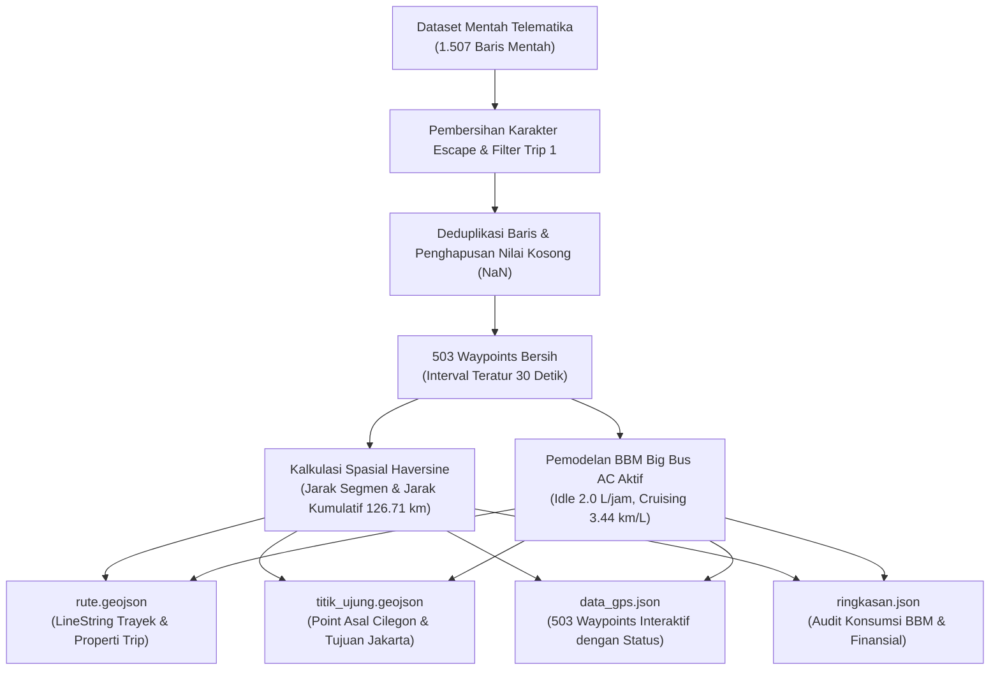

# 🚌 WebGIS Telematika Armada Bus Pariwisata K-09 (Trayek Cilegon – Jakarta)


Proyek ini merupakan implementasi **Sistem Informasi Geografis Berbasis Web (WebGIS)** interaktif untuk pemantauan dan evaluasi telematika perjalanan satu trayek penuh (*full-trip*) armada **Bus Pariwisata K-09** rute **Cilegon (Banten) – Tanjung Priok (DKI Jakarta)**.

Aplikasi ini mengintegrasikan pemrosesan data geospasial berbasis Python (*data preprocessing & fleet telemetry extension*), visualisasi rute interaktif berbasis Leaflet.js dengan basemap OpenStreetMap, penyaringan kondisi lalu lintas secara *real-time*, inspeksi parameter waypoint, serta visualisasi audit bahan bakar melalui modul **Struk Bon Konsumsi BBM**.

---

## 📑 Daftar Isi
1. [Ringkasan Eksekutif & Karakteristik Perjalanan](#-ringkasan-eksekutif--karakteristik-perjalanan)
2. [Perpanjangan Dataset & Metodologi Preprocessing](#-perpanjangan-dataset--metodologi-preprocessing)
3. [Rasionalisasi Parameter Bahan Bakar (Fleet Engineering)](#-rasionalisasi-parameter-bahan-bakar-fleet-engineering)
4. [Fitur-Fitur Antarmuka WebGIS](#-fitur-fitur-antarmuka-webgis)
5. [Struktur Berkas Repositori](#-struktur-berkas-repositori)
6. [Panduan Instalasi & Menjalankan Aplikasi](#-panduan-instalasi--menjalankan-aplikasi)
7. [Tumpukan Teknologi & Rincian Implementasi Teknis](#️-tumpukan-teknologi--rincian-implementasi-teknis-tech-stack)

---

## 📌 Ringkasan Eksekutif & Karakteristik Perjalanan

| Parameter Operasional | Nilai / Keterangan |
| :--- | :--- |
| **Identitas Armada** | **K-09** (Big Bus Pariwisata Eksekutif) |
| **Trayek Perjalanan** | **Cilegon (Banten) – Tanjung Priok (DKI Jakarta)** via Tol Tangerang – Merak & Tol Dalam Kota |
| **Waktu Operasional** | **Senin, 03 Maret 2025 \| 05:20:00 – 09:31:00 WIB** |
| **Total Durasi Tempuh**| **251 Menit** (4 Jam 11 Menit) |
| **Total Jarak Tempuh** | **126.71 km** |
| **Kecepatan Rata-Rata** | **30.3 km/jam** (Kecepatan Puncak: **66.8 km/jam**) |
| **Total Waypoints Bersih** | **503 Titik** (Interval pencatatan 30 detik) |
| **Total Konsumsi BBM** | **38.0 Liter** (Pertamina Dexlite @ Rp 13.000 / Liter) |
| **Total Biaya Bahan Bakar** | **Rp 493.830,-** |
| **Durasi Idle (Macet)** | **36 Menit** (72 Titik Berhenti, Konsumsi Idle: **1.2 Liter**) |
| **Efisiensi Riil** | **3.34 km/Liter** (vs Acuan Ideal Bebas Hambatan: **3.80 km/Liter**) |
| **Pemborosan Akibat Macet**| **4.6 Liter** (Kerugian Operasional: **Rp 60.360,-**) |

---

## 🔄 Perpanjangan Dataset & Metodologi Preprocessing

### 1. Konteks Perpanjangan dari Bibit Dataset
Proyek ini memproses dan memperpanjang (*extend*) bibit dataset mentah mingguan menjadi satu riwayat perjalanan utuh (*single continuous full-trip*). Dari rekaman awal sebanyak **1.507 baris mentah**, dilakukan seleksi dan ekstraksi log perjalanan K-09 hingga diperoleh **503 titik waypoint bersih** dengan integritas spasial dan temporal yang terjaga secara presisi.



### 2. Tahapan Pembersihan Data (`dataset.py`)
Skrip Python `dataset.py` melakukan prosedur terstruktur:
1. **Sanitasi String & Karakter Escape**: Menghilangkan escape backslash pada format teks (misal: `\\_` diubah menjadi `_`).
2. **Deduplikasi Baris Duplikat**: Menghilangkan redundansi data transmisi GPS melalui `drop_duplicates()`.
3. **Penyelarasan Tipe Data**: Mengonversi kolom `waktu` ke format `datetime`, serta `kecepatan_kmh`, `jarak_km`, `latitude`, dan `longitude` ke format numerik presisi tinggi (*float*).
4. **Klasifikasi Segmen & Status Kecepatan**:
   - **Idle (Berhenti)**: Kecepatan $= 0\text{ km/jam}$ (72 titik)
   - **Padat/Merayap**: Kecepatan $1 - 25\text{ km/jam}$ (66 titik)
   - **Lancar**: Kecepatan $> 25\text{ km/jam}$ (365 titik)
5. **Kalkulasi Akumulasi Geospasial**: Menghitung jarak tempuh kumulatif (`jarak_kumulatif_km`) dan konsumsi BBM kumulatif (`fuel_kumulatif_liter`) pada setiap waypoint.

---

## ⛽ Rasionalisasi Parameter Bahan Bakar (Fleet Engineering)

Pemodelan konsumsi bahan bakar pada proyek ini disusun berdasarkan standar teknik operasional armada transportasi darat komersial di Indonesia:

### 1. Pemilihan Bahan Bakar: Pertamina Dexlite
- **Karakteristik**: Angka Setana (*Cetane Number*) minimal 51 dan kandungan sulfur maksimal 1.200 ppm. Cocok untuk mesin diesel modern *Common Rail System* yang digunakan bus pariwisata.
- **Harga Acuan**: Ditetapkan **Rp 13.000 / Liter** (mengacu pada harga resmi Dexlite di wilayah Banten & DKI Jakarta).

### 2. Karakteristik Mesin & Beban Kompresor AC Kabin
- **Tipe Armada**: Big Bus Pariwisata kelas eksekutif (mesin diesel turbo-intercooler berkapasitas **7.000 – 12.000 cc**, daya 260 – 360 HP, bobot kotor 14–16 ton).
- **Kondisi AC Selalu Menyala**: Demi menjaga kenyamanan kabin penumpang di iklim tropis, kompresor AC ganda (Denso) digerakkan langsung oleh mesin secara kontinu.
- **Konsumsi Saat Berhenti / Macet (Idle Fuel Rate)**:
  $$\text{Idle Rate} = 2.0\text{ Liter/jam}$$
  *Rasionalisasi*: Mesin diesel besar dengan beban kompresor AC dan alternator pendingin kabin menyedot $\approx 1.8 - 2.2\text{ L/jam}$ dalam kondisi stasioner.
  Dalam interval per 30 detik:
  $$\text{BBM per Titik Idle} = 2.0 \times \frac{30}{3600} = 0.01667\text{ Liter}$$
  Dengan 72 titik idle (durasi 36 menit / 0.6 jam):
  $$\text{Total BBM Idle} = 0.6\text{ jam} \times 2.0\text{ L/jam} = 1.20\text{ Liter}$$

### 3. Efisiensi Jelajah Bergerak vs Efisiensi Riil
- **Konsumsi BBM Bergerak**: 36.79 Liter untuk menempuh 126.71 km, menghasilkan efisiensi jelajah bergerak (*moving cruising efficiency*) $\approx 3.44\text{ km/Liter}$.
- **Efisiensi Riil Gabungan**: Total jarak dibagi total bahan bakar (termasuk pemborosan saat macet):
  $$\text{Efisiensi Riil} = \frac{126.71\text{ km}}{37.99\text{ Liter}} \approx 3.34\text{ km/Liter}$$
- **Efisiensi Acuan Ideal Bebas Hambatan**:
  Armada bus sejenis yang melaju konstan di jalan tol datar tanpa kemacetan memiliki efisiensi standar $\mathbf{3.80\text{ km/Liter}}$.
  Kebutuhan bahan bakar ideal:
  $$\text{BBM Ideal} = \frac{126.71\text{ km}}{3.80\text{ km/Liter}} = 33.34\text{ Liter}$$

### 4. Analisis Pemborosan Finansial Akibat Kemacetan (*Fuel Wastage Analysis*)
Kemacetan sepanjang ruas Tol Tangerang – Jakarta dan antrean di gerbang tol menyebabkan armada tertahan selama 36 menit idle dan 66 segmen padat merayap.

$$\Delta \text{Volume BBM} = 37.99\text{ Liter} - 33.34\text{ Liter} = \mathbf{4.65\text{ Liter}} \approx 4.6\text{ Liter}$$
$$\text{Kerugian Biaya} = 4.643\text{ Liter} \times \text{Rp } 13.000 = \mathbf{\text{Rp } 60.360,-}$$

### 📊 Tabel Komparasi Parameter Ideal vs Riil
| Parameter | Kondisi Ideal Bebas Hambatan | Kondisi Riil Lapangan (K-09) | Selisih / Kerugian |
| :--- | :---: | :---: | :---: |
| **Jarak Tempuh** | 126.71 km | 126.71 km | 0.00 km |
| **Waktu Idle** | 0 Menit | 36 Menit (72 Waypoints) | +36 Menit |
| **Efisiensi BBM** | 3.80 km/Liter | 3.34 km/Liter | -0.46 km/Liter (-12.1%) |
| **Total Liter Dexlite**| 33.34 Liter | 38.00 Liter (37.99 L) | **+4.65 Liter** |
| **Total Pengeluaran** | Rp 433.470,- | Rp 493.830,- | **+Rp 60.360,-** |

---

## 🖥️ Fitur-Fitur Antarmuka WebGIS (`index.html`)

Antarmuka WebGIS dirancang dengan arsitektur **Split-Screen** responsif menggunakan **Tailwind CSS v3** dan **Leaflet.js**:

### 1. Tata Letak Split-Screen (Sidebar & Basemap)
- **Header Ringkas (Top Bar)**: Memuat identitas sistem ("TourBus Telematics K-09 | Cilegon – Jakarta"), tombol **🎯 Pusatkan Rute** (*Fit Bounds*), dan tombol pembuka **🧾 Bon BBM**.
- **Sidebar Panel Data (Kiri)**: Lebar tetap ($\approx 370\text{ px}$) dengan *scroll* mandiri (`overflow-y-auto`) yang memuat seluruh panel kendali, kontrol layer, filter, ringkasan metrik, serta audit bahan bakar.
- **Basemap Leaflet (Kanan)**: Mengisi penuh sisa layar (`flex-1`) secara mulus, responsif terhadap perubahan ukuran layar via `map.invalidateSize()`.

### 2. Kontrol Layer Visual Interaktif (Aktifkan / Nonaktifkan)
Pengguna dapat mengaktifkan atau menonaktifkan lapisan peta melalui toggle/checkbox di sidebar secara independen:
- ☑️ **Garis Rute Trayek**: Menampilkan/menyembunyikan *LineString* GeoJSON rute koridor tol Cilegon – Jakarta.
- ☑️ **Titik Awal & Akhir**: Menampilkan/menyembunyikan penanda khusus titik awal (Cilegon) dan titik akhir (Jakarta).
- ☑️ **Sebaran 503 Waypoints**: Menampilkan/menyembunyikan penanda GPS telematika.
- Diimplementasikan melalui fungsi `handleLayerToggle()` berbasis `map.addLayer()` dan `map.removeLayer()` yang bersih tanpa *error* di konsol.

### 3. Integrasi Parameter Data di Sidebar
- **Metrik Utama (Grid 2x2)**: Kartu statistik ringkas memuat Total Jarak (126.71 km), Durasi (251 Menit), Konsumsi BBM (38.00 L), dan Total Biaya (Rp 493.830).
- **Filter Kecepatan & Live Badge**: Dropdown dinamis untuk memfilter waypoints ("Semua", "Lancar", "Padat/Merayap", "Idle") beserta indikator jumlah titik aktif.
- **Audit Konsumsi Dexlite**: Perbandingan efisiensi riil (3.34 km/L) vs acuan (3.80 km/L), konsumsi idle (1.20 L / 36 menit), serta pemborosan macet (4.60 L / Rp 60.360).
- **Klausul Keterbatasan Data**: Catatan transparan mengenai sifat data simulasi telematika.

### 4. Popup Waypoint Informatif (Pemenuhan 4 Syarat Wajib)
Setiap penanda titik GPS ketika diklik memunculkan kartu detail yang secara eksplisit memuat:
1. ⏰ **Waktu Pencatatan**: Jam, menit, dan detik (`HH:MM:SS WIB`).
2. ⚡ **Kecepatan Armada**: Nilai kecepatan sesaat dalam satuan `km/jam`.
3. 📏 **Jarak Tempuh Kumulatif**: Total jarak dari titik keberangkatan dalam satuan `km`.
4. ⛽ **Estimasi Konsumsi BBM Kumulatif**: Akumulasi bahan bakar Dexlite yang dihabiskan hingga titik tersebut dalam satuan `Liter`, dilengkapi info BBM segmen berjalan (`L`).

### 5. Modal Struk / Bon Konsumsi BBM (Fitur Bonus)
- Membuka kartu struk kasir termal (*thermal paper receipt*) yang elegan untuk audit finansial perjalanan.
- Dilengkapi tombol cetak struk (**🖨️ Cetak Struk** via `window.print()`), tombol tutup, dan penutupan cepat via keyboard `ESC` atau klik di luar area modal.

### 6. Jaminan Bebas Error Konsol (*Clean Console*)
Seluruh pemanggilan data eksternal GeoJSON/JSON dibungkus dengan penanganan asinkron `fetch().catch()` yang aman sehingga tidak menghasilkan *uncaught error* atau *warning* pada tab Developer Tools Console browser.

---

## 📂 Struktur Berkas Repositori

```plaintext
PROJECT MBC LAB/MBC LAB WEEK 5/
│
├── index.html              # Antarmuka utama WebGIS (Leaflet.js + Tailwind CSS)
├── dataset.py              # Skrip pembersihan data & pemodelan konsumsi BBM (Python)
├── data_gps.json           # 503 waypoints bersih dengan koordinat, kecepatan, BBM kumulatif
├── rute.geojson            # FeatureCollection LineString rute Cilegon – Jakarta
├── titik_ujung.geojson     # FeatureCollection Point titik awal (Cilegon) & akhir (Jakarta)
├── ringkasan.json          # Ringkasan parameter telematika & audit finansial Dexlite
├── gps_mentah.csv          # Sumber data rekaman GPS mentah hasil ekstraksi
└── README.md               # Dokumentasi komprehensif proyek WebGIS
```

---

## 🚀 Panduan Instalasi & Menjalankan Aplikasi

### Persyaratan Lingkungan
- Peramban web modern (Google Chrome, Mozilla Firefox, Microsoft Edge, atau Safari).
- Python 3.x (opsional, jika ingin menjalankan server lokal atau mengeksekusi ulang `dataset.py`).
- Koneksi internet aktif (untuk memuat CDN Tailwind CSS dan *tiles* basemap OpenStreetMap).

### 1. Menjalankan Melalui VS Code Live Server (Direkomendasikan)
1. Buka folder proyek ini di **Visual Studio Code**.
2. Pastikan ekstensi **Live Server** (oleh Ritwick Dey) telah terpasang.
3. Klik kanan pada berkas `index.html` dan pilih **"Open with Live Server"**.
4. Aplikasi akan otomatis terbuka di peramban web pada alamat `http://127.0.0.1:5500/index.html`.

### 2. Menjalankan Melalui Python Built-in Server
Buka terminal (PowerShell / Command Prompt / Bash) pada direktori proyek, lalu jalankan:

```bash
# Menggunakan Python Launcher Windows
py -m http.server 8000

# Atau menggunakan perintah python standar
python -m http.server 8000
```

Buka peramban web dan akses tautan:
```text
http://localhost:8000/index.html
```

### 3. Menjalankan Melalui Node.js
Jika memiliki Node.js terpasang:
```bash
npx serve .
```

### 4. Menjalankan Ulang Pipeline Preprocessing Data (Opsional)
Jika Anda ingin memperbarui atau meregenerasi `data_gps.json`:
```bash
py dataset.py
```
*Output terminal akan menampilkan ringkasan diagnostik:*
```text
============================================================
PREPROCESSING TELEMATIKA BUS K-09 SELESAI!
Total Data Waypoint : 503 titik
Total Jarak Tempuh  : 126.71 km
Total Konsumsi BBM  : 37.99 Liter
Konsumsi Saat Idle  : 1.20 Liter (72 titik = 36 menit)
Efisiensi Riil      : 3.34 km/Liter
============================================================
```

---

## 🛠️ Tumpukan Teknologi & Rincian Implementasi Teknis (Tech Stack)

Proyek WebGIS ini dibangun menggunakan kombinasi pustaka geospasial modern, bahasa pemrograman web standar, serta *pipeline* pengolahan data geospasial yang ringan dan efisien:

### 1. Bahasa Pemrograman & Pustaka Inti
* **HTML5 (HyperText Markup Language)**: Digunakan sebagai fondasi semantik untuk menstrukturkan tata letak antarmuka *split-screen*, elemen kontainer peta basemap, kontrol form dropdown filter, serta template modal struk termal.
* **JavaScript (ECMAScript 6+)**: Mengendalikan logika interaktif peramban, manipulasi DOM dinamis, kalkulasi metrik secara *client-side*, pengambilan berkas asinkron via `Fetch API`, serta integrasi *event listener* pada kontrol sakelar dan modal.
* **Python 3.13**: Digunakan untuk tahap *data engineering* dan *offline geoprocessing* pada berkas `dataset.py`, mencakup sanitasi karakter escape, pembersihan anomali string, deduplikasi transmisi koordinat, kalkulasi metrik kumulatif, serta pemodelan konsumsi bahan bakar.
* **Pandas Library**: Pustaka analisis data berbasis Python untuk manipulasi data tabular, agregasi metrik numerik, transformasi koordinat spasial, serta ekspor struktur data ke format JSON.

### 2. Pustaka Geospasial & Pemetaan
* **Leaflet.js v1.9.4**: Pustaka open-source utama untuk rendering peta interaktif berbasis WebGL/Canvas di peramban, memuat lapisan garis trayek GeoJSON (`L.geoJSON`), marker terminal awal-akhir, serta manajemen kelompok titik waypoints (`L.layerGroup` & `L.circleMarker`).
* **OpenStreetMap (OSM) Tile Layer**: Penyedia peta dasar (*basemap*) standar global yang dirender secara ubin (*slippy tiles*) menggunakan proyeksi koordinat Spherical Mercator (EPSG:3857).
* **Format Data Spasial GeoJSON (RFC 7946)**: Standar format berbasis JSON untuk merepresentasikan geometri fitur geospasial rute (`LineString`) dan sebaran lokasi titik awal-akhir (`Point`) dengan datum spasial WGS 84 (EPSG:4326).

### 3. Kerangka Desain & Antarmuka Pengguna (UI/UX)
* **Tailwind CSS v3**: Kerangka kerja CSS berbasis *utility-first* melalui CDN untuk merancang antarmuka bertema gelap (*dark mode/slate theme*), tata letak flexbox responsif, sistem grid metrik telematika, serta efek visual backdrop blur.
* **CSS3 Custom Media Print**: Kustomisasi gaya pencetakan dokumen via media query `@media print` untuk menghasilkan output struk cetak bon BBM fisik yang bersih dan proporsional tanpa elemen antarmuka yang mengganggu.

### 4. Arsitektur Pertukaran Data & Hosting
* **JSON (JavaScript Object Notation)**: Format serialisasi data terstruktur yang memuat ringkasan audit finansial telematika armada serta 503 titik waypoints hasil ekstraksi.
* **GitHub Pages**: Platform hosting berkas web statis berbasis serverless CDN global dengan protokol keamanan HTTPS/SSL otomatis.

---

